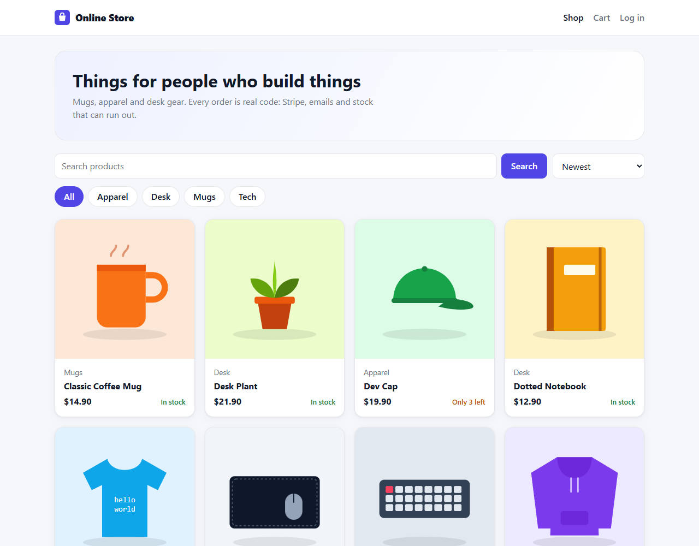
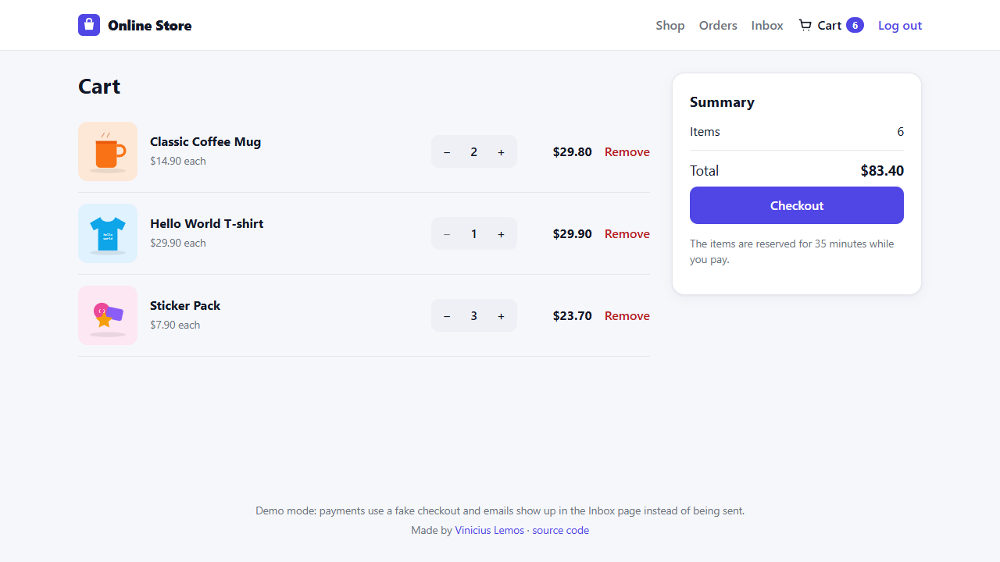
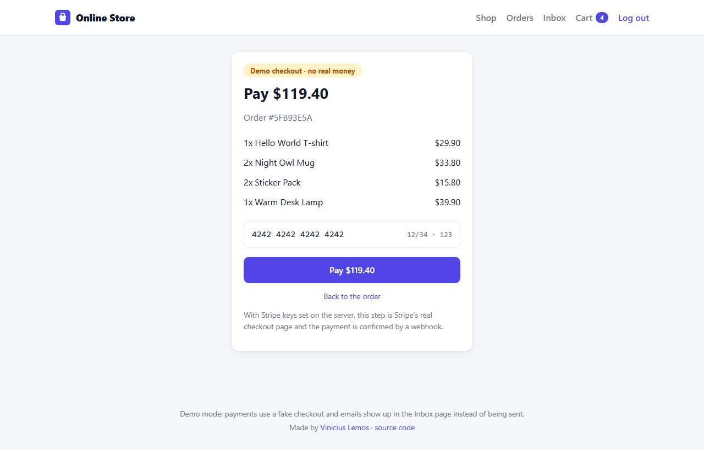
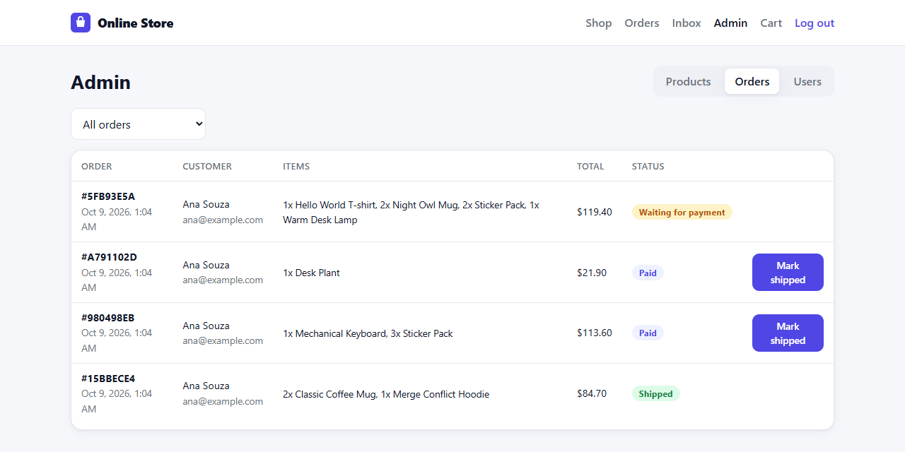
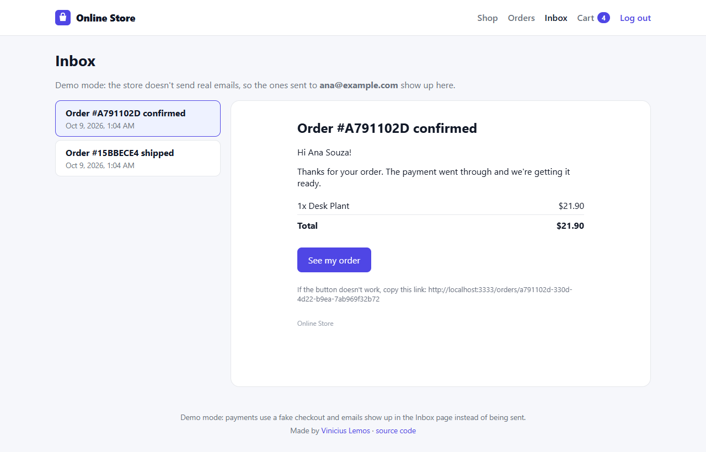

# Online Store


A full e-commerce: catalog, cart, Stripe payments, accounts with permissions (customer and admin), emails and an admin panel. Node + Express + TypeScript + PostgreSQL on the back end, React on the front end.

**Try it here:** https://online-store-6ogi.onrender.com

The live version runs in demo mode (more on that below): the payment is a fake checkout page and the emails show up in an Inbox page inside the store. It's on Render's free plan, so the first visit after a while can take about 50 seconds.



## Why I built it

It's the biggest project in my portfolio. I wanted something close to a real store, where the hard parts aren't skipped: money that can't be off by a cent, stock that can't go negative when two people buy the last unit at the same time, a payment that is confirmed by Stripe and not by the browser, and a login that can actually be revoked. I built it in stages, each one with its own tests:

- [x] **Stage 1:** structure, database, sign up, login and permissions
- [x] **Stage 2:** emails (account confirmation and password reset)
- [x] **Stage 3:** products, stock and admin routes
- [x] **Stage 4:** cart, orders and Stripe payments
- [x] **Stage 5:** React front end
- [x] **Stage 6:** deploy

## What it does

**For customers:** browse and search the catalog, filter by category, add to the cart straight from the product card or from the product page (the cart lives in the database, so it follows you between devices), see more products from the same category, check out with Stripe, follow the order status on a Placed → Paid → Shipped timeline, get an email when the payment goes through and when the order ships. Confirming the email is required before the first order, and there's a "forgot my password" flow.

**For admins:** create, edit and archive products, see which ones are low on stock, see every order with the customer and mark paid orders as shipped, and promote or demote other users.

<p>
  
  
</p>
<p>
  
  
</p>

## Tech

- **API:** Node.js, Express 5 and TypeScript
- **Database:** PostgreSQL with Drizzle ORM and SQL migrations
- **Front end:** React 19 with React Router, plain CSS (with dark mode)
- **Payments:** Stripe Checkout + webhooks
- **Emails:** Nodemailer (any SMTP)
- **Validation:** Zod
- **Tests:** Vitest + Supertest, 78 integration tests running on an in-memory Postgres (PGlite), and Playwright end to end tests in a real browser

## How the important parts work

**Sessions instead of JWT.** When someone logs in, the API generates a random token and sends it in an `httpOnly` cookie. The database only keeps the SHA-256 hash of the token. Logout deletes the session on the server, so even a stolen cookie stops working, and since the role is read from the database on every request, a demoted admin loses access on the next click. The cookie is `SameSite=Lax`, and on top of that the API refuses requests that change data when the `Origin` header isn't the store's own.

**Passwords.** bcrypt hashes. Login gives the same answer for a wrong password and for an email with no account, and takes the same time in both cases (it compares against a fake hash), so nobody can find out who has an account. Login, sign up and "forgot password" are limited to 10 attempts every 15 minutes per IP.

**Email links.** The confirmation and password reset links carry a random token, and again only its hash is stored. They're single use (the token is deleted with `DELETE ... RETURNING`, so two clicks at the same time can't both use it), they expire (24h and 1h), and asking for a new email kills the old link. Resetting the password logs out every session.

**Money.** Every price is an integer in cents. The order copies the name and price of each item, so editing a product later doesn't change what the customer paid.

**Stock.** At checkout the cart becomes an order inside a database transaction, and the stock is reserved with `UPDATE products SET stock = stock - n WHERE id = ? AND stock >= n`. If two people try to buy the last unit at the same time, the second update changes no row and that checkout fails, with no oversell (there's a test that fires both requests at once). The database also has a `CHECK (stock >= 0)`, as a last line of defense.

**Payment.** The order starts as `pending` and the API creates a Stripe Checkout session. The browser is sent to Stripe, and the order only becomes `paid` when Stripe calls the webhook. The webhook checks Stripe's signature over the raw body, so nobody can fake a "paid" event by calling the route, and it's idempotent, because Stripe can send the same event more than once. If the checkout expires or the customer cancels, the order is canceled and the reserved stock goes back. A job also cleans up pending orders older than 35 minutes, in case a webhook never arrives.

**Demo mode.** Without Stripe keys, the API uses a fake checkout page that calls the same "mark as paid" code the webhook uses. Without SMTP, emails are kept in memory and the Inbox page shows the ones sent to the logged in person (only theirs). That's what lets the live version work without real money or real emails, and the whole flow can be tried locally without creating an account anywhere.

## Running locally

You need Node 22 or newer.

```bash
git clone https://github.com/ViniciuscLemos/online-store
cd online-store
npm install
npm run seed -w server   # optional: adds the sample products
npm run dev
```

The store opens at http://localhost:5173 (the API runs at http://localhost:3333 and Vite forwards `/api` to it).

You don't need to install a database: without `DATABASE_URL`, the API uses [PGlite](https://pglite.dev), which is Postgres compiled to run inside Node, and saves the data in `server/.pglite`. Migrations run on their own when the API starts. To use a real Postgres:

```bash
docker compose up -d
cp server/.env.example server/.env   # and uncomment DATABASE_URL
```

To make someone an admin, sign up normally and then run (with PGlite, stop the API first, since only one process can use the database folder):

```bash
npm run make-admin -w server -- your@email.com
```

### Using real Stripe and real emails

Everything is in `server/.env.example`. For Stripe, get the test keys in the [Stripe dashboard](https://dashboard.stripe.com/test/apikeys) and, locally, forward the webhooks with the Stripe CLI:

```bash
stripe listen --forward-to localhost:3333/api/webhooks/stripe
```

Put `STRIPE_SECRET_KEY` and the `whsec_...` that the command prints in `server/.env`, and the checkout button starts going to Stripe's real page (test card `4242 4242 4242 4242`). For emails, set `SMTP_URL` with any SMTP server.

### Tests

```bash
npm test
```

Each test file starts its own in-memory Postgres and applies the migrations, so the tests run real SQL with no database mocks and no Docker. The Stripe tests use the real Stripe library to sign and verify the webhooks; only the call that creates the checkout session is faked. On GitHub Actions there's a second job that builds everything and starts the API on a normal PostgreSQL.

There are also end to end tests with Playwright: a real browser signs up, confirms the email in the demo inbox, adds things to the cart, pays and checks the order, on a desktop and on a phone screen. Another Playwright file runs [axe](https://github.com/dequelabs/axe-core) on every page, logged in and out, in light and dark mode, and fails if it finds an accessibility problem (contrast, missing labels, alt text...). They run on the built store, so build first:

```bash
npm run build
npm run test:e2e
```

## Deploy

`render.yaml` describes the deploy: a Postgres database and one web service. Render runs `npm run build` (React + TypeScript), starts the API, and the API also serves the React build, so the store and the API live on the same address. The sample products are added on start (`SEED_SAMPLE_PRODUCTS`), and setting the Stripe keys and `SMTP_URL` turns each demo part into the real thing, with no code change.

I first tried to deploy with PGlite to avoid a separate database, but Postgres running inside Node needs more than the 512 MB of the free instance, so the deploy uses a real Postgres (Render's free one expires after 30 days, so for something permanent the `DATABASE_URL` can point to any other Postgres, like Neon).

## API routes

```
GET    /api/products                       catalog (search, category, sort, pages)
GET    /api/products/categories
GET    /api/products/:slug

POST   /api/auth/register                  creates the account and logs in
POST   /api/auth/login
POST   /api/auth/logout
GET    /api/auth/me
POST   /api/auth/verify-email
POST   /api/auth/resend-verification
POST   /api/auth/forgot-password
POST   /api/auth/reset-password

GET    /api/cart
PUT    /api/cart/items/:productId          sets the quantity (0 removes)
DELETE /api/cart

POST   /api/orders                         checkout: creates the order and returns the payment page
GET    /api/orders
GET    /api/orders/:id
POST   /api/orders/:id/cancel
POST   /api/webhooks/stripe

GET    /api/admin/products                 admin only from here on
POST   /api/admin/products
PATCH  /api/admin/products/:id
DELETE /api/admin/products/:id             archives
GET    /api/admin/orders
POST   /api/admin/orders/:id/ship
GET    /api/admin/users
PATCH  /api/admin/users/:id/role
```

## Structure

```
server/
  drizzle/           SQL migrations generated by drizzle-kit
  src/
    app.ts           builds the Express app (gets the database, mailer and payment provider, so tests can swap them)
    server.ts        connects to the database, runs migrations, serves the React build
    auth/            sessions, email tokens, middlewares and login routes
    products/        catalog and admin product routes
    cart/            cart routes
    orders/          checkout, payment confirmation, cancel and ship
    payments/        Stripe and the demo checkout behind one interface
    email/           mailer (SMTP or in-memory inbox) and templates
    admin/           user management
  test/              integration tests
web/
  src/pages/         shop, product, cart, checkout, orders, inbox, login and admin pages
  src/store.jsx      logged in user, cart and server mode shared by every page
```
